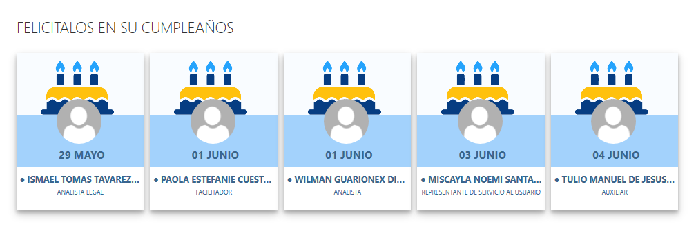

# React Birthdays Web Part

## Summary
El Web Part de cumpleaños muestra los próximos cumpleaños a celebrarse en los días próximos en una compañía mediante la lectura de la base de datos de cumpleaños cargados a sharepoint a una lista en el tenant's root de sharepoint online con el nombre de "Birthdays."

Si los usuarios se encuentan disponibles el office365 es posible leer su fotografía y mostrarla en el componente utilizando webpart persona de [ui-office-fabric](https://developer.microsoft.com/en-us/fabric-js/components/persona/persona).

Para sincronizar los datos desde el sistema de recursos humanos, creamos un servicio de consola en .Net que se encarga de tomar todos los datos y subirlo e la lista del tenant's root.

Debajo la imagen del control montado en un sharepoint online con las mejoras realizadas sobre el control realizado por Joao Mendes.

## Used SharePoint Framework Version 

## Applies to

* [SharePoint Framework](https:/dev.office.com/sharepoint)
* [Office 365 tenant](https://dev.office.com/sharepoint/docs/spfx/set-up-your-development-environment)

## Prerequisites
 
La lista en el sitio de tenant root debe tener de título "Birthdays"  con la siguiente estructura:

Columna|Tipo|Requerido|Descripción
--------------------|----|--------|----------
JobTitle| Text| no|
Birthday| DateTime | true|
userAADGUID| Text| no | 
Title| Text| true
email| Text| true

## Disclaimer
**THIS CODE IS PROVIDED *AS IS* WITHOUT WARRANTY OF ANY KIND, EITHER EXPRESS OR IMPLIED, INCLUDING ANY IMPLIED WARRANTIES OF FITNESS FOR A PARTICULAR PURPOSE, MERCHANTABILITY, OR NON-INFRINGEMENT.**

---

## Minimal Path to Awesome - please follow all the steps.

- Clone el repositorio
- Ejecute en la línea de comando los siguientes comandos:
  - `npm install`
  - `gulp build`
  - `gulp bundle --ship`
  - `gulp package-solution --ship`
  - `Add and Deploy Package to AppCatalog `
  - `Go to API Management - from SharePoint Admin Center new experience,  and Approve the Permission Require to Use Graph API SCOPES`

 

## Features
- using React for building SharePoint Framework client-side web parts
- using React components for building Birthday web part
- using MSGraph API to get data from SharePoint Lists 
- using MSGraph API to read users from AAD
- using @PnP/PnPjs to create a List, add, update, delete Items.

Basado en la librería de Joao Mendes publicado en el siguiente [enlace](https://techcommunity.microsoft.com/t5/sharepoint-developer/employee-birthday-calendar-web-part/td-p/454251)
